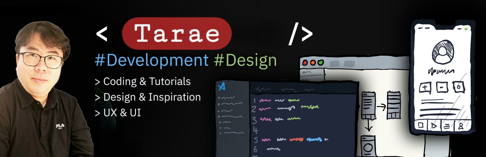

# 😙Hi! Nice to see you

### Welcome to my page!

```js
const tarae = {
  age : "love",
  languages: ["Javascript", "Typescript", "Python", "PHP", "CSS", "HTML"],
  tools: ["React", "NextJS", "TailwindCSS", "Supabase", "Devextreme", "Wordpress"],
  architecture: ["microservices", "design system pattern"]
};
```
<br>
## ⚡ Technologies


[](https://skillicons.dev)


<br>
**Talking about Personal Stuffs:**

- 👨🏽‍💻 현재 작업하는거에요. [작업중](https://github.com/damoayo/);
- 🌱 현재 NextJS와 Supabase를 공부하고 있습니다.
- 👯 Crawling에 관심이 많아요. [Crawling ](https://github.com/damoayo/) 🤝;
- 🤔 디자인은 참 어렵네요 😭;
- 💬 무엇이든 문의주시면, 정성스런 답변을 드립니다 ^^;
- ⚡️ 재미있는 사실: 저는 중어중문을 전공했고, 산림기능사와 조경기능사 자격증, 그리고 지게차/굴삭기 자격증도 가지고 있어요!.
- 📫 저에게 연락하는 방법: mamapai@naver.com; KakaoTalk : mamapai
<br>


<br>


