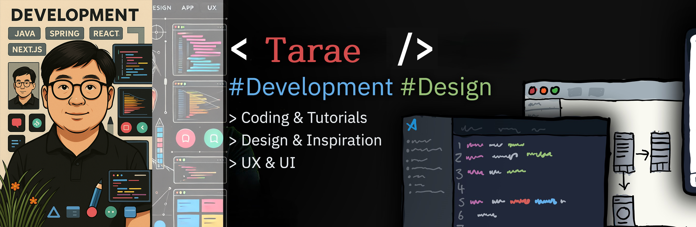

# 😙Hi! Nice to see you

## 🦄 Welcome to my page!

```js
const tarae = {
  age: "love",
  languages: ["Javascript", "Typescript", "Python", "PHP", "CSS", "HTML"],
  tools: [
    "React",
    "NextJS",
    "TailwindCSS",
    "Supabase",
    "Devextreme",
    "Wordpress",
  ],
  architecture: ["microservices", "design system pattern"],
};
```

## ⚡ Technologies

[](https://skillicons.dev)&nbsp;
▬▬▬▬▬▬▬▬▭▭ `Lv.8` <br>
[](https://skillicons.dev)&nbsp;
▬▬▬▬▬▬▬▭▭▭ `Lv.7` ↑ <br>
[](https://skillicons.dev)&nbsp;&nbsp;&nbsp;
▬▬▬▬▬▬▭▭▭▭ `Lv.6` ⇈

## 🐸 Talking about Personal Stuffs:\*\*

- 🌱 현재 Java를 열공하고 있습니다.^^
- 👯 요즘 성능최적화에 관심이 많아요. github의 Actions과의 연계기능도 관심이 많아요 🤝;
- 🤔 디자인은 참 어렵네요 😭;
- 💬 무엇이든 문의주시면, 정성스런 답변을 드립니다 ^^;
- ⚡️ 재미있는 사실: 저는 중어중문을 전공했고, 산림기능사와 조경기능사 자격증, 그리고 지게차/굴삭기 자격증도 가지고 있어요!.
- 📫 저에게 연락하는 방법: mamapai@naver.com &nbsp;/ &nbsp; mamapai &nbsp;
  <br>

## ☠ 현재 작업중 Repository 👻

- 🐥 Landing-page01 / [미리보기](https://landing-page01-two.vercel.app/) <br> / &nbsp;&nbsp;&nbsp; <br> / HTML, CSS, JavaScript를 사용한 반응형 포트폴리오 웹사이트 [작업중...](https://github.com/damoayo/landing-page01) <br><br>

- 🐥 DX-Cloud / [미리보기](https://dx-cloud.vercel.app/) <br> /   <br> / DevExtreme위주의 간단한 웹페이지 [작업중...](https://github.com/damoayo/DX-Cloud) <br><br>
- 🐥 music_box / [미리보기](https://music-box-hf9o.vercel.app/) <br> /  &nbsp; <br> / NextJS(버전14) 위주의 YoutubeMusic 웹사이트 [작업중...](https://github.com/damoayo/music_box) <br><br>
- 1️⃣  Vite버전 / [미리보기](https://vite-2024project-3wbr.vercel.app/) / - &nbsp;[작업중...](https://github.com/damoayo/vite-2024project) <br>
- 2️⃣  React버전 / [미리보기](https://react-2024project.vercel.app/) / - &nbsp;[작업중...](https://github.com/damoayo/react-2024project) <br> 
  / 웹페이지를 3가지 Framework를 사용하여 3가지 버전으로 작업하는걸 목표로 한다. 

<br>


<br>
<br>


<br>
